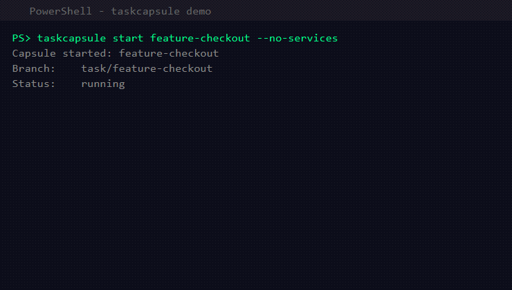

# TaskCapsule

> Pause one coding task. Handle the interruption. Resume without losing your place.

[](https://github.com/vtino17/taskcapsule)
[](https://github.com/vtino17/taskcapsule/actions/workflows/ci.yml)
[](https://github.com/vtino17/taskcapsule/releases)
[](https://github.com/vtino17/taskcapsule/blob/main/LICENSE)

TaskCapsule is a local-first CLI that turns a coding task into a resumable **capsule**: an isolated Git worktree plus its development processes, ports, logs, notes, and latest check result.

No cloud account. No daemon. No API key. No AI model. No automatic commit, stash, reset, or push.

```
taskcapsule start feature-checkout
taskcapsule note feature-checkout "Continue retry test next"
taskcapsule pause feature-checkout

taskcapsule start urgent-hotfix
taskcapsule pause urgent-hotfix

taskcapsule resume feature-checkout
taskcapsule where feature-checkout
```

## Demo



## Problem

Every task switch costs context: stopping servers, switching branches, finding the right file, remembering what to do next. TaskCapsule automates this so you can switch tasks in seconds.

## Install

```bash
go install github.com/vtino17/taskcapsule/cmd/taskcapsule@latest
```

Or download a binary from [GitHub Releases](https://github.com/vtino17/taskcapsule/releases).

## Quick start

Inside an existing Git repository:

```bash
# Create the project configuration
taskcapsule init

# Review .taskcapsule.json, then create a capsule
taskcapsule start my-feature

# Save the thought you do not want to forget
taskcapsule note my-feature "Implement checkout validation next"

# Stop services while preserving the worktree and context
taskcapsule pause my-feature

# Restart the task later
taskcapsule resume my-feature
taskcapsule where my-feature
```

## Commands

| Command     | Description                              |
| ----------- | ---------------------------------------- |
| `init`      | Create `.taskcapsule.json`              |
| `start`     | Create a capsule with an isolated worktree and services |
| `pause`     | Stop services and release runtime resources |
| `resume`    | Restart services and restore the task context |
| `list`      | List capsules                            |
| `status`    | Show detailed capsule state              |
| `note`      | Save the current thought or next action  |
| `where`     | Reconstruct where you left off           |
| `check`     | Run and record a validation command      |
| `logs`      | Read service logs                        |
| `handoff`   | Generate a secret-safe Markdown handoff  |
| `delete`    | Remove a capsule and its worktree safely |
| `doctor`    | Diagnose stale PIDs, missing worktrees, and local state |
| `version`   | Show build information                   |

## Configuration

`.taskcapsule.json` example:

```json
{
  "version": 1,
  "defaults": {
    "baseBranch": "main",
    "branchPrefix": "task/"
  },
  "services": {
    "api": {
      "command": ["go", "run", "./cmd/api"],
      "environment": {
        "PORT": "${PORT:api}"
      },
      "health": {
        "type": "http",
        "url": "http://127.0.0.1:${PORT:api}/health"
      }
    }
  }
}
```

## Why not just use Git worktree, tmux, or Docker Compose?

Those tools remain useful. TaskCapsule coordinates the task-level lifecycle around them.

| Tool | Responsibility |
|------|---------------|
| Git worktree | Branch and working directory isolation |
| tmux | Terminal sessions |
| Docker Compose | Containerized services |
| TaskCapsule | Worktree, local processes, ports, logs, notes, checks, and handoff as one task |

## Safety by design

- Never automatically commits, stashes, resets, merges, rebases, or pushes
- Refuses to delete a dirty worktree unless `--force` is explicit
- Keeps the Git branch after a capsule is deleted
- Stores state atomically with restrictive permissions
- Never persists inherited environment variable values
- Redacts likely secrets from generated handoff reports
- Rolls back already-started services when a later service fails its health check

## Platform support

| Platform | Status |
|----------|--------|
| Linux | Full |
| macOS | Full |
| Windows | Experimental (no Job Objects yet) |

## Architecture

```
CLI → Application Layer → Git / Process / State / Health / Ports
```

Each component lives under `internal/` behind focused interfaces.

## License

Apache 2.0
